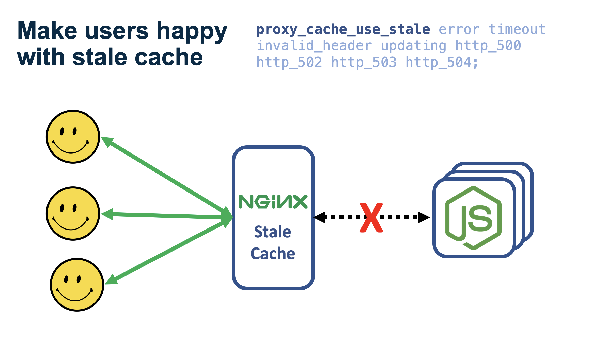

Web response time has a clear impact on if potential prospects will stay on your site and become engaged with your product. What happens when a website is slower than desired? They leave before you can woo them. Obviously, website reliability is very key as well. When we make an api request, or request a remote stylesheet or javascript asset, we expect it to given to us. What happens when the resource is not available or the upstream server that has the resource is down? Not good.

These two problems can be addressed very elegantly and succinctly by using out of the box nginx and OpenResty caching capabilities.

Caching can be hard, and introduces complexity. When we begin to work out our caching strategy there are important questions we must answer. Some of these include:

 1. **Do we do an in-process cache for one service or an out-of-process cache that multiple services can benefit from?**

 2. **If we want to do out-of-process caching. How do we do it?**

 3. **What if an upstream service is failing, how can we continue to serve the response if cached?**

 4. **How to handle cache invalidation?**

There tons of ways we could go about solving each one of these problems using different software packages, caching applications etc. It would also depend on the skills of your team, the throughput demands required by the system, and assuming you are not starting from scratch, leveraging what you have already built. If you are starting from scratch... Nice! Have fun!

For the purposes of this article we will only be focused on caching "safe" requests (`GET`, `HEAD`, `OPTIONS`). Caching non-safe request methods like `POST` requires other considerations when it comes to both fast response time, resilliency, and managing complexity. In these cases you might investigate using a more involved `cache-aside` or `read-through/write-through` pattern. Both of these topics could posts by themselves.

This blog is also focused on eventual consistency not strong consistency caching. If you are unfamiliar with these two terms here is a quick catch-up:

*Strong consistency*: data in a store of record gets updated to all consumers as soon as a write is made.

*Eventual consistency*: data that gets updated in a store of record that gets updated to all consumers eventually, but not at the time of write neccesarily.

I've found that typically eventual consistency in caching for most web development is just fine.

If you are interested in a strongly consistent approach here are a few options:

1. Skip to the bottom of this article where I point you to resources for adding a distributed redis cache.

2. It requires a commercial nginx+ subscription, but [checkout nginx+ cache clustering](https://www.nginx.com/blog/shared-caches-nginx-plus-cache-clusters-part-1/).

<a id="In-Process-vs-Out-of-Process-Application-Cache"></a>

### In-Process vs Out-of-Process Application Cache

In the world of software architecture. Less is more! When you are building a solution an important question to ask is, could it be simplier. If you have one node.js service for example, it might make more sense to have an in memory store as opposed to spinning up a separate cache. This might be better considering the inherit complexity when you create an in memory cache. I've definitely gotten bitten on a couple occasions from using code that leveraged an in process cache. This was due to the over-complexity of the implementation, stemming from what I think is a lack of a standard approach to this problem. There are alot of different ways to set up an in memory cache! In any case, simplicity is your best friend! This is the huge benefit for setting up caching with nginx. It's easy.

**Will multiple services be making requests, and where is the upstream server?**

If you already have a reverse proxy or an API gateway in front of the service calls (I hope you do) then it makes sense to add a cache to the "front door". This avoids duplicating in memory caches for each service being called. Especially if your team(s) are polyglot!

**Will the latency of requests to an out of process cache negate any performance gain that it would give you?**

The response time it takes to get a cached result from a cache might negate caching in the first place, as it might take longer to get the cached result than going all the way to the upstream. Additionally, if the 99% percentile response time for the upstream service call is not very long you could maybe make your SLA without caching. At that point there are still benefits to the cache, such as a fallback for upstream failures. As you will see later, this is a powerful pattern and easy to implement in nginx.

**What if you have many application instances?**

Back to eventual vs strong consistency mentioned earlier. The more application instances you have with in-memory stores the more important data consistency might become, as different application instances might have different versions of the upstream response. When you use nginx as a central store, and are not using clustering or redis, this is still reduced because typically nginx can operate with fewer instances than most application servers can such as node.js.

Ultimately, remember that simplicity is your friend here. Whatever you do, make a conscious effort to make as few components with as little logic as possible, because you, or someone else, will eventually get confused by the code. It's inevitable! Minimize this.

<a id="Setting-Up-Nginx-Caching"></a>

### Setting Up Nginx Caching

[You can access the completed tutorial repo here](https://github.com/danielbh/openresty-caching-example)

A resource that rarely changes is a great candidate for caching. For example: a stylesheet or script. Depending on if your application is internet facing you could put assets behind a CDN like AWS Cloudfront as your users might be distributed around the world. In other cases it could make sense to have certain backend calls for data or assets cached on a cache you control, in a proxy, to avoid the round trip to upstream services.

**How do we setup an nginx cache?**

```conf

http {

  proxy_cache_path /tmp/my_cache keys_zone=my_cache:10m levels=1:2 inactive=600s max_size=100m;

  proxy_cache_valid 200 302 10m;
  proxy_cache_valid 404      1m;
  proxy_cache_methods GET;

  add_header X-Cache $upstream_cache_status;

  server {
      listen 80 default_server;
      location / {
        proxy_cache my_cache;
        proxy_cache_key $uri;
        proxy_pass  http://goapp:8000;
      }
  }
}

```
`proxy_cache_path`: This is how we setup the cache.

- `/tmp/my_cache`: This is the path where a cache exists. The directory you use is the unique identifer for this cache when used in other directives that you want to apply to it. Here we are calling the cache "my_cache".

- `keys_zone=my_cache:10m`: This is the maxium storage that is is being allocated for cache keys. This allocates 10 mb for cache keys. 10 mb is about 80,000 keys.

- `levels=1:2`: This is the hierarchy of directories being used in the cache for files. Here we have a two level hiearchy. By default nginx uses a one level hiearchy. This is less efficient because items would be retrieved from the same folder which can slowdown file access.

- `inactive=600s`: This is the eviction time for a cache entry. After this duration the entry will be removed from the cache. Note: This is different from `proxy_cache_valid` which states if an item is stale or not.

- ` max_size=100m;`: Upper limit of the size of the cache. It is optional; if not specified it will use all available disk space. When cache limit reached. A process called the cache manager removes the files that were least recently used to reduce the cache size.

`proxy_cache_valid`: This directive says under what circumstances a request will be cached and how long until an entry is stale.

  - `code`: The http status codes whose corresponding response will be cached.

  - `time`: The amount of time until the cache entry is considered "stale" This is different from the `inactive` directive which will remove the item from the cache.

`proxy_cache_methods`: The REST methods who's responses will be cached.

`add_header X-Cache $upstream_cache_status`: This will tell the consumer of the request the state of the cache. The status can be either "MISS", "BYPASS", "EXPIRED", "STALE", "UPDATING", "REVALIDATED", or "HIT".

`proxy_cache my_cache;`: This is the cache that this location block will use. You can set each location block to use a different cache. This is useful if you want to set different parameters for different location blocks. Perhaps you want to set `inactive` differently for different location blocks.

`proxy_cache_key:` This is the cache key for the look-up of the response. Above we are using the $uri variable. The $uri is the path used after the host. For example, if you made a request to `website.com/path` the $uri would be `/path`. The $uri variable is one of many convenience variables we can use in our nginx configurations. [Here is the list](http://nginx.org/en/docs/http/ngx_http_core_module.html#var_status).

<a id="Handling-Failing-Upstreams-with-Cache"></a>

### Handling Failing Upstreams with Cache

This next feature I'm going to tell you about is hands-down one of my favorite nginx features. I love it because how powerful it is, and how easy it is to do. Here is the scenario where it applies most...



 If you are sending "safe" requests (GET, HEAD, OPTIONS), and the upstream is failing, you can set nginx to just return that cached request, even if it's stale. I've seen this work in production and it is bea-ut-iful. When you do this just be sure that you have alerting on the failing upstream service so you know there is an issue.

```conf
...

proxy_cache_use_stale error timeout invalid_header updating http_500 http_502 http_503 http_504;
proxy_cache_background_update on;

...

server {
      listen 80 default_server;

      location /cached/ {
        proxy_cache my_cache;
        proxy_cache_key $uri;
        proxy_pass  http://goapp:8000/;
      }

      location / {
        proxy_pass  http://goapp:8000;
      }
  }
```

`proxy_cache_use_stale`: These are all the error situations that you want to fallback to a stale cache.

`proxy_cache_background_update`: Allows starting a background subrequest to update an expired cache item. During this time a stale cached response is returned to the client. This is neccesary so that a stale cache will be used when an upstream is failing.

`/cached/`: This location block will use the cache and will fallback to it when the upstream fails. Notice the trailing slash after `cached` and `http://goapp:8000`. This matters!

`/`: This location block remains un-cached.

`http://goapp:8000`: This url maps to a go application that will fail every other request with a 500. It does this on the `/failodd` endpoint.

Let's see this in action:

```shell

# un-cached route

$ curl -D - localhost:8080/failodd

HTTP/1.1 200 OK
Server: openresty/1.15.8.1
Date: Sat, 24 Aug 2019 17:12:08 GMT
Content-Type: text/plain; charset=utf-8
Content-Length: 18
Connection: keep-alive

Everything is fine

$ curl -D - localhost:8080/failodd

HTTP/1.1 500 Internal Server Error
Server: openresty/1.15.8.1
Date: Sat, 24 Aug 2019 17:12:11 GMT
Content-Type: text/plain; charset=utf-8
Content-Length: 28
Connection: keep-alive

Uh oh something bad happened

# cached route

$ curl -D - localhost:8080/cached/failodd

HTTP/1.1 200 OK
Server: openresty/1.15.8.1
Date: Sat, 24 Aug 2019 17:12:50 GMT
Content-Type: text/plain; charset=utf-8
Content-Length: 18
Connection: keep-alive
X-Cache: MISS

Everything is fine

$ curl -D - localhost:8080/cached/failodd

HTTP/1.1 200 OK
Server: openresty/1.15.8.1
Date: Sat, 24 Aug 2019 17:13:17 GMT
Content-Type: text/plain; charset=utf-8
Content-Length: 18
Connection: keep-alive
X-Cache: HIT

Everything is fine

```

Notice you can tell that it was cached because the `X-Cache` response header was sent back.

<a id="Cache-Invalidation-and-Bypass"></a>

### Cache Invalidation and Bypass

Ah yes... The bane of every caching strategy. What happens when a cached resource changes and you immediately
want to use the new version. So there is good new and bad news when it comes to Nginx/OpenResty. Bad news first. [Cache purging through exposing an endpoint from nginx requires nginx+](https://docs.nginx.com/nginx/admin-guide/content-cache/content-caching/#purge). However, fear not. There are some good work-arounds depending on your situtation. Here we will go through two examples.

**Bypass**

For the first one, the pre-requisite is that you don't know if there is a new version of the cached response, but you force it through the use of `proxy_cache_bypass` directive. You could also just send a query string through that would change the cache key, but `proxy_cache_bypass` is easier to read and more standard.

To do this you can use a cookie or header. The cookie is just prefaced with `$cookie_` then you add the name of your cookie. so you could do `$cookie_yourkey` then you add `$arg_cookie`. Similarly, if you want use a header just add `$http_`. Below we are using a header called `$http_bypass_cache`. Here the value of the header does not matter, just the key. However, it must have some value when you send it. Another important thing to note is **you must** have `underscores_in_headers on` enabled.

Quick note on the `Cache-Control` request header. You could use `$http_cache_control`, but that might be confusing for consumers since they might think the value matters which it does not. i.e. `no-cache` vs `max-age=<seconds>`. Nginx does not have this built in 😭.

```conf
server {
 ...

  underscores_in_headers one;

  ...

  location /cached/ {
    ...
    proxy_cache_bypass $http_bypass_cache;
    proxy_pass  http://goapp:8000/;
  }

  ...
}
```

Let's use the fail-odd example again. This time on the odd number of request we will pass a cache bypass header through and it fail with a 500 even though it's cached.

```conf

$ curl -H "bypass_cache:true" -D - localhost:8080/cached/failodd

HTTP/1.1 200 OK
Server: openresty/1.15.8.1
Date: Sat, 24 Aug 2019 18:03:05 GMT
Content-Type: text/plain; charset=utf-8
Content-Length: 18
Connection: keep-alive
X-Cache: BYPASS

Everything is fine

$ curl -H "bypass_cache:true" -D - localhost:8080/cached/failodd

HTTP/1.1 500 Internal Server Error
Server: openresty/1.15.8.1
Date: Sat, 24 Aug 2019 18:03:07 GMT
Content-Type: text/plain; charset=utf-8
Content-Length: 28
Connection: keep-alive

Uh oh something bad happened

```

**Invalidation of API calls**

Now what about API calls backed by a database. For simplicity of this example I again want to emphasize that depending on the use-case and if this proxy handles un-safe requests for these resources (`PUT`, `DELETE`, `POST`, `PATCH`) we might implement a different pattern here.

Remember that cache-purging requires an nginx+ commercial license if you want it out of the box, but you still have other options if you would rather build it than buy it.

Also, the pre-requisite for these approaches is that on every database write you need to send out a fire and forget web request to an nginx cache invalidation endpoint or, if you elect to use a distributed cache, you send the invalidation request to the cache itself, and the nginx instances would just be connected to it.

Lastly, keep in mind the consequences of purging a shared cache. You might want to add things like authorization to confirm those who attempt to purge the cache are allowed to do so.

Here are some approaches you could take:

1) This guy, FRiCKLE, [created an nginx module that enables cache purging](https://github.com/FRiCKLE/ngx_cache_purge). Disclaimer! I have not used it, but I plan to do some experiments with it. I will update with a post when I've had time to do this.

2) Another alternative could be to use an in process lru implemented in Lua with [lua-resty-lrucache](https://github.com/openresty/lua-resty-lrucache) module.

3) You could also use the nginx or OpenResty redis module. Your microservice that is making writes to the database could be connected to an out of process cache, for example... redis. Then you just setup a cache purging endpoint which removes the entry from redis. You could also have logic to read the redis entry. You have a few options here. A disclaimer, for these is that I know of only one instance using the lua-resty-redis module in production. The other two I have not tried.

   - [ngx http redis module](https://www.nginx.com/resources/wiki/modules/redis/)
   - [openresty-redis-module](https://github.com/openresty/redis2-nginx-module#readme)
   - [lua-resty-redis](https://github.com/openresty/lua-resty-redis)

<a id="bottom"></a>

### Conclusion

As you can see nginx offers a variety of options for any backend caching strategy that you'd like to create. Most patterns are very simple and easy to implement. For free software you get some good bang for your buck. However, some options that are more complicated than others.

Nginx and OpenResty are great technologies, but can be a beast especially when you start customizing and adding logic via Lua with OpenResty. I'm an nginx and OpenResty specialist. If are working with OpenResty and would like help on your project. [Drop me a line](/contact). Happy to help.


